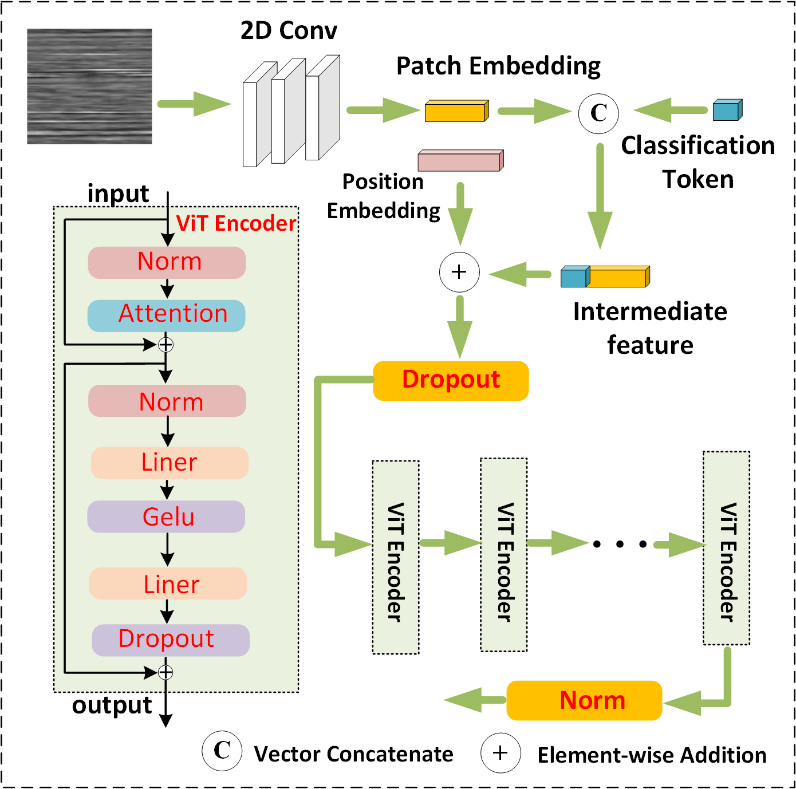

This procedure is associated with the paper ViT-Based EEG Analysis Method for Auditory Attention Detection, which presents our EEG analysis method for auditory attention detection (AAD) as utilized in the first Chinese Auditory Attention Decoding Challenge, ISCSLP 2024. 

    

We propose an efficient electroencephalogram (EEG) analysis method based on Vision Transformer (ViT), achieving accurate sound source localization through EEG signals. To address the spatiotemporal characteristics of EEG signals, our team designed an EEG-to-Image conversion method that transforms raw EEG data into image-based inputs compatible with the ViT model. Subsequently, the ViT encoder employs multi-head self-attention modules to process the converted signals, capturing complex temporal dependencies while preserving positional information. This method leverages ViT's self-attention mechanism for temporal feature extraction, enhancing feature representation, while also improving classification accuracy through data augmentation and feature optimization. Experiments were conducted on the AHU EEG dataset, which includes auditory attention data from 10 subjects under audio-only (AO) and audiovisual (AV) conditions, tested in both single-subject (SS) and cross-subject (CS) scenarios.

In the 1st China Auditory Attention Decoding Challenge at ISCSLP 2024, our approach achieved an accuracy of 91.73% in the SS-AO/SS-AV track and 51.36% in the CS-AO/CS-AV track, securing third place in the cross-subject scenario and demonstrating state-of-the-art recognition performance.

checkpoint for ViT_L:
https://www.alipan.com/s/9XGewwhsmCR
